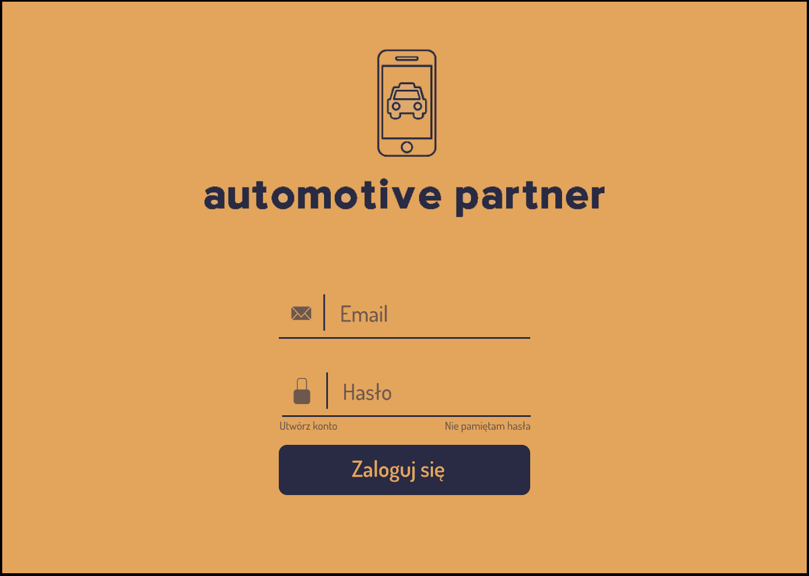
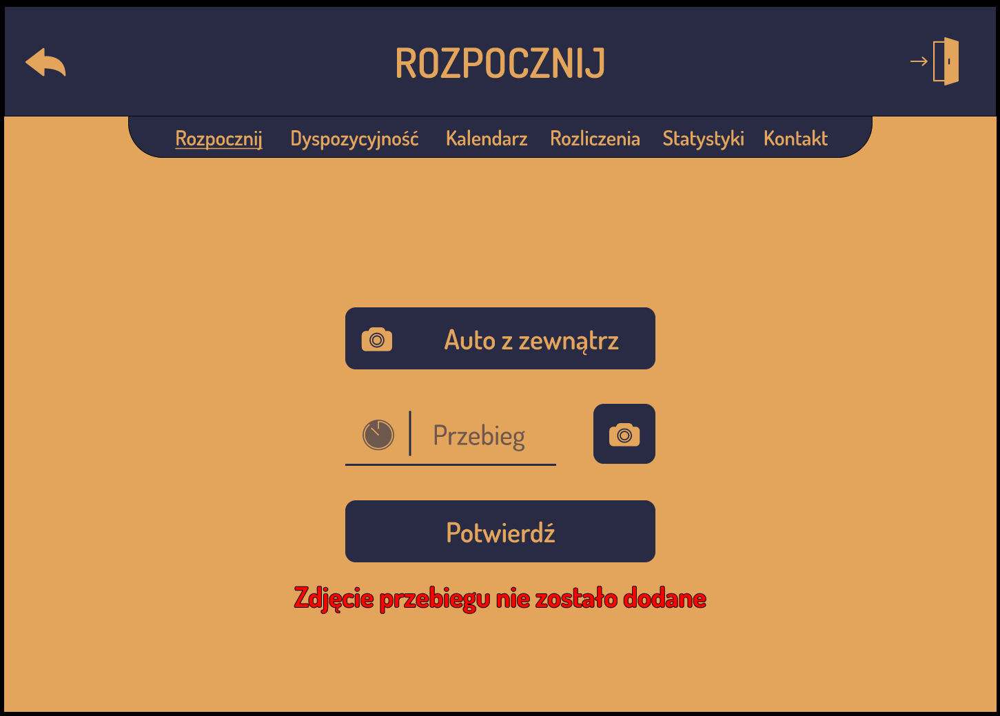
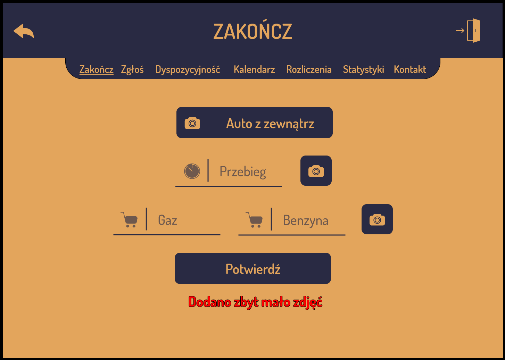
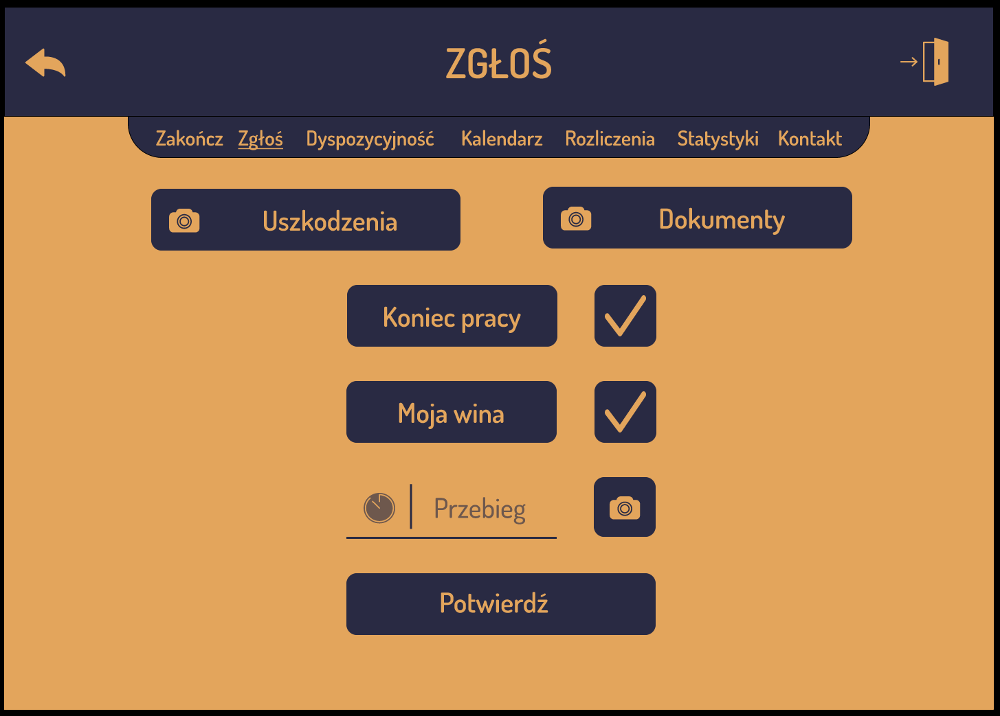
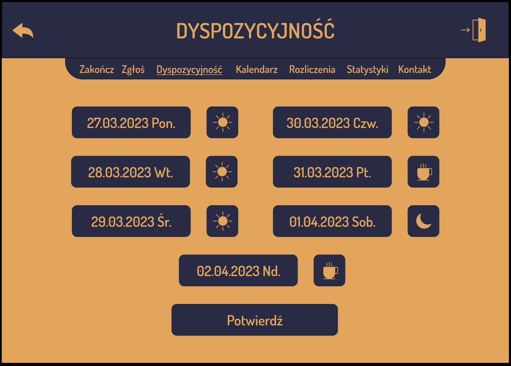
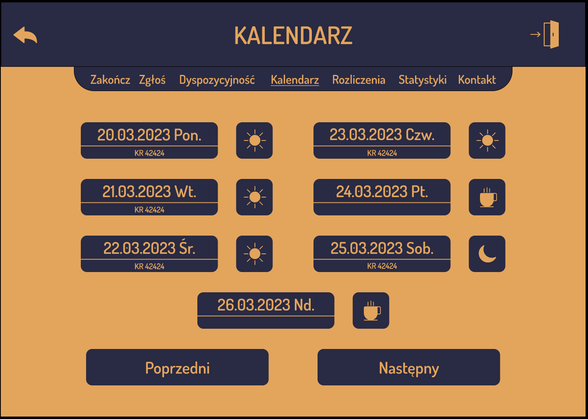
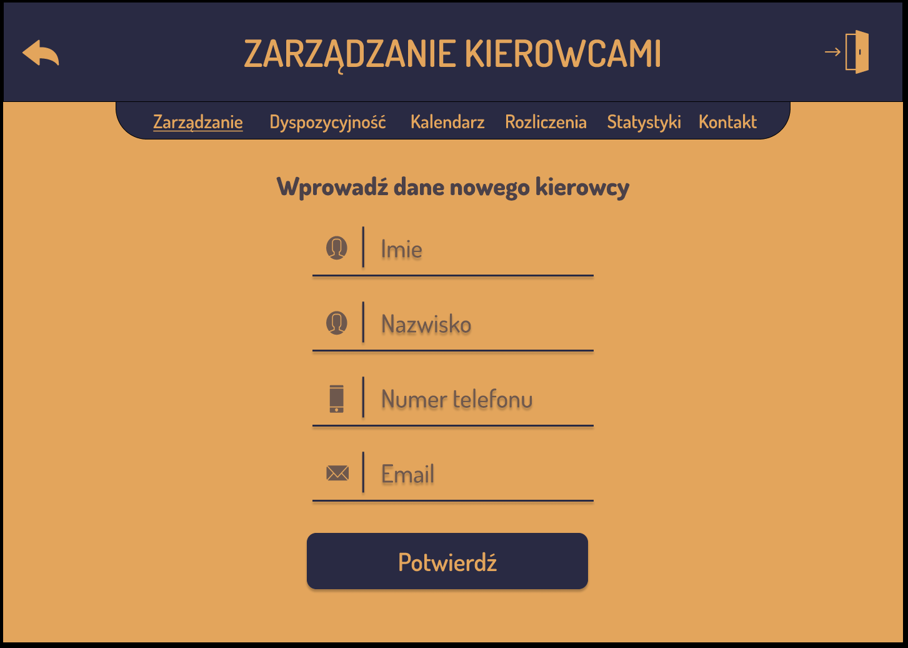
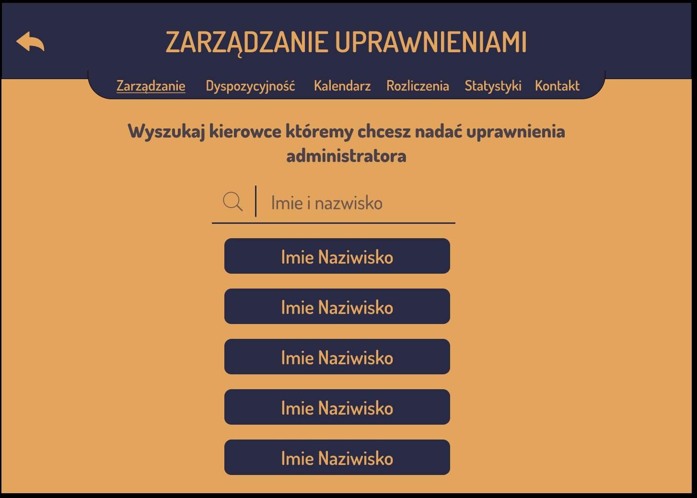
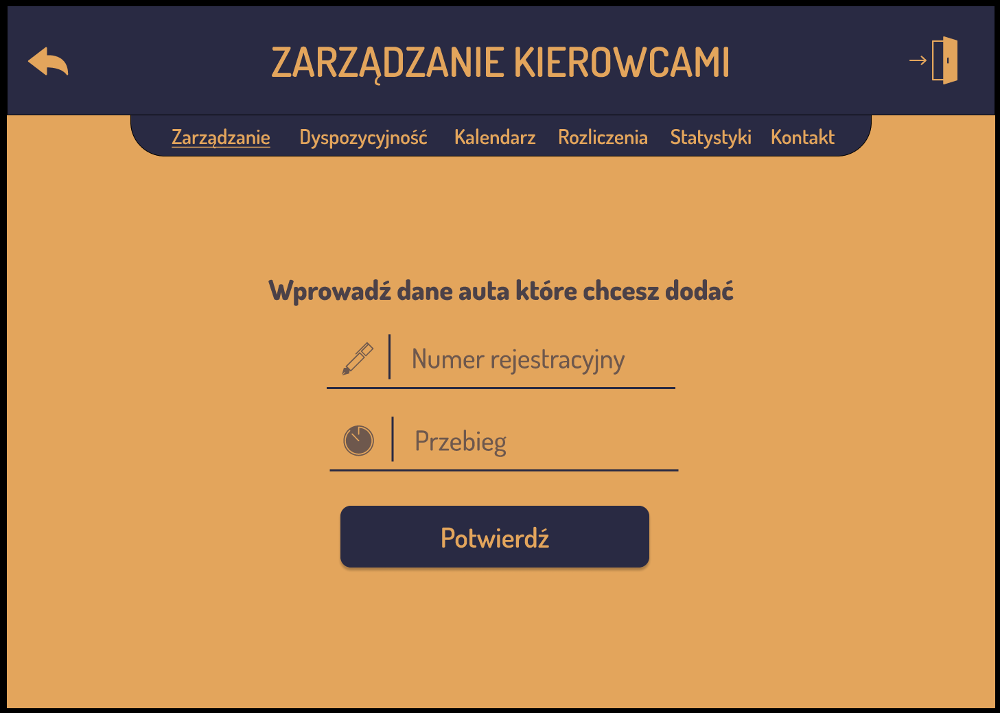

# Automotive Partner

> Website for a taxi corporation.

## Table of Contents

* [General Info](#general-information)
* [Technologies Used](#technologies-used)
* [Features](#features)
* [Screenshots](#screenshots)
* [Launch](#launch)
* [Project Status](#project-status)
* [Room for Improvement](#room-for-improvement)
* [Acknowledgements](#acknowledgements)

## General Information

The website for this taxi corporation provides a comprehensive platform for both drivers and management to efficiently manage their operations. Drivers can easily start and end their shifts, report accidents, submit availability, view their calendar, check billing and statistics, and report any billing errors. Management has the ability to manage drivers and cars, including adding/removing them, blocking/unlocking, granting/revoking permissions, and updating mileage. They can also access important information such as schedules, damages, availability, calendar, bills, and reported bugs, and make modifications to shift parameters as needed. Overall, this website serves as a central hub for all the necessary tools and functionalities to streamline the operations of the taxi corporation.

## Technologies Used

- Java 20
- Spring framework 6
- Spring Boot 3.1.0
- PostgreSQL
- Lombok
- React
- jUnit 5
- Git
- GitHub

## Features

### Driver can:
- start work
- end the shift
- report an accident
- submit availability
- check the calendar
- see billing
- report any error in billing
- check statistics

### Management can:
- manage drivers:
  - add and remove
  - block and unlock
  - grant and take away permissions
 - manage cars:
  - add and remove
  - block and unlock
  - update mileage
- check schedule, damages, availability and calendar
- view bills and check and modify reported bugs
- modify shifts parameters

## Screenshots

### Drivers view

### Management view

## Launch

To launch this website just click [here](https://www.automotive-partner.com).

## Project Status

Project is: _in progress_.

## Room for Improvement

Room for improvement:

- Create an IOS and Android application for drivers and management.

## Acknowledgements

Give credit here.

- This project was created as a final project in the Advanced Web Application Design course.
- Many thanks to Adrian Widłak who oversaw the whole project.
